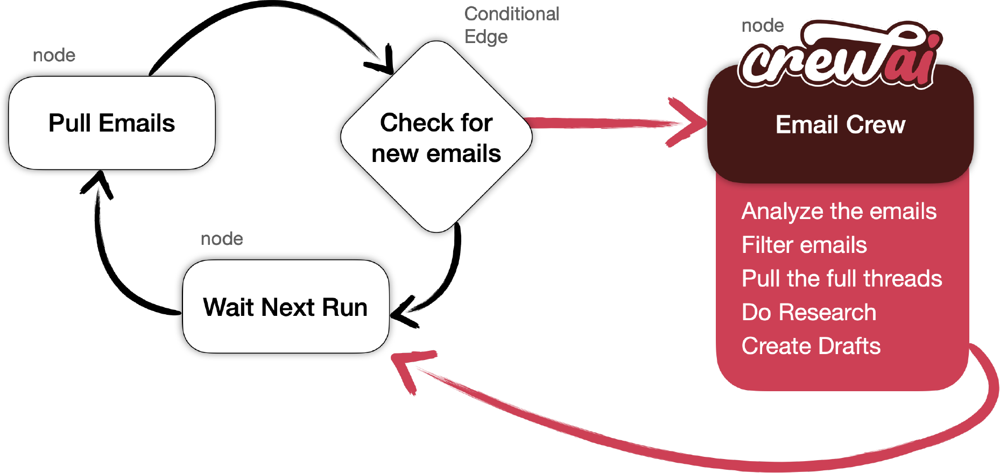

# CrewAI + LangGraph Agentic Workflow Exploration

## Introduction

This project explores how CrewAI and LangGraph can be used together to build agentic AI workflows, multi-step task execution systems, and AI orchestration pipelines. The implementation demonstrates how autonomous AI agents can collaborate, manage workflows, and execute structured tasks using modern agentic AI concepts.

The project is based on CrewAI workflow examples and was explored to better understand:
- Multi-agent orchestration
- AI workflow automation
- Structured AI outputs
- Task execution pipelines
- Agent collaboration
- Workflow state management
- LangGraph-based orchestration concepts



---

## Technologies Used

- Python
- CrewAI
- LangGraph
- LangChain
- OpenAI API
- Gmail API

---

## Features

- Agentic AI workflow exploration
- Multi-agent task orchestration
- AI workflow automation
- Structured task execution
- Workflow state management
- Gmail draft automation example
- LangGraph integration with CrewAI

---

## Project Structure

- `./src/graph.py` — Defines workflow graph nodes and edges
- `./src/nodes.py` — Node execution logic
- `./src/state.py` — Workflow state definitions
- `./src/crew/agents.py` — CrewAI agent configurations
- `./src/crew/tasks.py` — CrewAI task definitions
- `./src/crew/crew.py` — Crew orchestration setup
- `./src/crew/tools.py` — Gmail draft automation tools

---

## Running the Project

### 1. Configure Environment
Copy:

```bash
.env.example
```

and configure the required environment variables.

---

### 2. Setup Gmail Credentials

Follow Google's Gmail API setup instructions:

https://developers.google.com/gmail/api/quickstart/python#authorize_credentials_for_a_desktop_application

Download the credentials file and rename it:

```bash
credentials.json
```

Place it in the project root directory.

---

### 3. Install Dependencies

```bash
pip install -r requirements.txt
```

---

### 4. Run the Application

```bash
python main.py
```

---

## Learning Goals

This repository was explored to understand practical implementations of:
- Agentic AI systems
- AI orchestration
- Multi-step reasoning workflows
- Tool integration concepts
- Autonomous task execution
- LangGraph workflow management
- CrewAI agent collaboration

---

## Disclaimer

This repository is based on CrewAI example workflows and was explored for learning and experimentation purposes to better understand modern agentic AI systems and orchestration concepts.

---

## License

This project is released under the MIT License.
